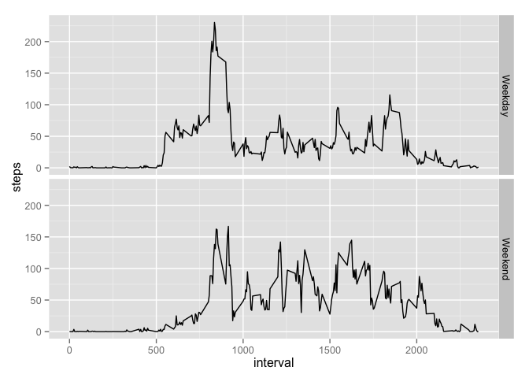

# Reproducible Research: Peer Assessment 1
##Loading and preprocessing the data
Show any code that is needed to:

* Load the data (i.e. read.csv())
* Process/transform the data (if necessary) into a format suitable for your analysis
    * Processing for each step is included in the appropriate step


```r
library(dplyr)
```

```
## 
## Attaching package: 'dplyr'
## 
## The following object is masked from 'package:stats':
## 
##     filter
## 
## The following objects are masked from 'package:base':
## 
##     intersect, setdiff, setequal, union
```

```r
data<-read.csv("activity.csv")
```

##What is mean total number of steps taken per day?
For this part of the assignment, you can ignore the missing values in the dataset.

* Calculate the total number of steps taken per day
    * Table of data listed below

* Make a histogram of the total number of steps taken each day

* Calculate and report the mean and median of the total number of steps taken per day

```r
by_day<-data %>%
  filter (steps != "NA") %>%
  group_by(date) %>% 
  summarise_each(funs(sum), steps)
by_day
```

```
## Source: local data frame [53 x 2]
## 
##          date steps
## 1  2012-10-02   126
## 2  2012-10-03 11352
## 3  2012-10-04 12116
## 4  2012-10-05 13294
## 5  2012-10-06 15420
## 6  2012-10-07 11015
## 7  2012-10-09 12811
## 8  2012-10-10  9900
## 9  2012-10-11 10304
## 10 2012-10-12 17382
## 11 2012-10-13 12426
## 12 2012-10-14 15098
## 13 2012-10-15 10139
## 14 2012-10-16 15084
## 15 2012-10-17 13452
## 16 2012-10-18 10056
## 17 2012-10-19 11829
## 18 2012-10-20 10395
## 19 2012-10-21  8821
## 20 2012-10-22 13460
## 21 2012-10-23  8918
## 22 2012-10-24  8355
## 23 2012-10-25  2492
## 24 2012-10-26  6778
## 25 2012-10-27 10119
## 26 2012-10-28 11458
## 27 2012-10-29  5018
## 28 2012-10-30  9819
## 29 2012-10-31 15414
## 30 2012-11-02 10600
## 31 2012-11-03 10571
## 32 2012-11-05 10439
## 33 2012-11-06  8334
## 34 2012-11-07 12883
## 35 2012-11-08  3219
## 36 2012-11-11 12608
## 37 2012-11-12 10765
## 38 2012-11-13  7336
## 39 2012-11-15    41
## 40 2012-11-16  5441
## 41 2012-11-17 14339
## 42 2012-11-18 15110
## 43 2012-11-19  8841
## 44 2012-11-20  4472
## 45 2012-11-21 12787
## 46 2012-11-22 20427
## 47 2012-11-23 21194
## 48 2012-11-24 14478
## 49 2012-11-25 11834
## 50 2012-11-26 11162
## 51 2012-11-27 13646
## 52 2012-11-28 10183
## 53 2012-11-29  7047
```

```r
hist(by_day$steps, xlab="Steps", main="Histogram of Steps per day")
```

 

```r
mean(by_day$steps)
```

```
## [1] 10766.19
```

```r
median(by_day$steps)  
```

```
## [1] 10765
```

##What is the average daily activity pattern?
* Make a time series plot (i.e. type = "l") of the 5-minute interval (x-axis) and the average number of steps taken, averaged across all days (y-axis)

* Which 5-minute interval, on average across all the days in the dataset, contains the maximum number of steps?
    *  Computed below

```r
by_interval<-data %>%
  filter (steps != "NA") %>%
  group_by(interval) %>% 
  summarise_each(funs(mean), steps)
plot(by_interval$interval, by_interval$steps, type = "l", xlab="5 min Interval", ylab="Avg. Steps")
```

 

```r
filter(by_interval, steps==max(steps))
```

```
## Source: local data frame [1 x 2]
## 
##   interval    steps
## 1      835 206.1698
```
##Imputing missing values

Note that there are a number of days/intervals where there are missing values (coded as NA). The presence of missing days may introduce bias into some calculations or summaries of the data.

* Calculate and report the total number of missing values in the dataset (i.e. the total number of rows with NAs)

* Devise a strategy for filling in all of the missing values in the dataset. The strategy does not need to be sophisticated. For example, you could use the mean/median for that day, or the mean for that 5-minute interval, etc.
    *  Used the mean for the 5-min interval and added it to the table and then rpelaced NA's with this value

* Create a new dataset that is equal to the original dataset but with the missing data filled in.

* Make a histogram of the total number of steps taken each day and Calculate and report the mean and median total number of steps taken per day. 
    * Do these values differ from the estimates from the first part of the assignment? 
    * What is the impact of imputing missing data on the estimates of the total daily number of steps?

```r
sum(is.na(data))
```

```
## [1] 2304
```

```r
colnames(by_interval)<-c("interval", "avg_steps")
newdata<-merge(data, by_interval, by="interval") %>%
  select(steps, date, interval, avg_steps)
for(i in 1:length(newdata$steps)){
  if(is.na(newdata$steps[i])){
    newdata$steps[i]<-newdata$avg_steps[i]
  }
}

new_by_day<-newdata %>%
  group_by(date) %>% 
  summarise_each(funs(sum), steps)
new_by_day
```

```
## Source: local data frame [61 x 2]
## 
##          date    steps
## 1  2012-10-01 10766.19
## 2  2012-10-02   126.00
## 3  2012-10-03 11352.00
## 4  2012-10-04 12116.00
## 5  2012-10-05 13294.00
## 6  2012-10-06 15420.00
## 7  2012-10-07 11015.00
## 8  2012-10-08 10766.19
## 9  2012-10-09 12811.00
## 10 2012-10-10  9900.00
## 11 2012-10-11 10304.00
## 12 2012-10-12 17382.00
## 13 2012-10-13 12426.00
## 14 2012-10-14 15098.00
## 15 2012-10-15 10139.00
## 16 2012-10-16 15084.00
## 17 2012-10-17 13452.00
## 18 2012-10-18 10056.00
## 19 2012-10-19 11829.00
## 20 2012-10-20 10395.00
## 21 2012-10-21  8821.00
## 22 2012-10-22 13460.00
## 23 2012-10-23  8918.00
## 24 2012-10-24  8355.00
## 25 2012-10-25  2492.00
## 26 2012-10-26  6778.00
## 27 2012-10-27 10119.00
## 28 2012-10-28 11458.00
## 29 2012-10-29  5018.00
## 30 2012-10-30  9819.00
## 31 2012-10-31 15414.00
## 32 2012-11-01 10766.19
## 33 2012-11-02 10600.00
## 34 2012-11-03 10571.00
## 35 2012-11-04 10766.19
## 36 2012-11-05 10439.00
## 37 2012-11-06  8334.00
## 38 2012-11-07 12883.00
## 39 2012-11-08  3219.00
## 40 2012-11-09 10766.19
## 41 2012-11-10 10766.19
## 42 2012-11-11 12608.00
## 43 2012-11-12 10765.00
## 44 2012-11-13  7336.00
## 45 2012-11-14 10766.19
## 46 2012-11-15    41.00
## 47 2012-11-16  5441.00
## 48 2012-11-17 14339.00
## 49 2012-11-18 15110.00
## 50 2012-11-19  8841.00
## 51 2012-11-20  4472.00
## 52 2012-11-21 12787.00
## 53 2012-11-22 20427.00
## 54 2012-11-23 21194.00
## 55 2012-11-24 14478.00
## 56 2012-11-25 11834.00
## 57 2012-11-26 11162.00
## 58 2012-11-27 13646.00
## 59 2012-11-28 10183.00
## 60 2012-11-29  7047.00
## 61 2012-11-30 10766.19
```

```r
hist(new_by_day$steps, xlab="Steps", main="Histogram of Steps per day")
```

 

```r
mean(new_by_day$steps)
```

```
## [1] 10766.19
```

```r
median(new_by_day$steps)  
```

```
## [1] 10766.19
```
##Are there differences in activity patterns between weekdays and weekends?

For this part the weekdays() function may be of some help here. Use the dataset with the filled-in missing values for this part.

* Create a new factor variable in the dataset with two levels – “weekday” and “weekend” indicating whether a given date is a weekday or weekend day.

* Make a panel plot containing a time series plot (i.e. type = "l") of the 5-minute interval (x-axis) and the average number of steps taken, averaged across all weekday days or weekend days (y-axis). See the README file in the GitHub repository to see an example of what this plot should look like using simulated data.

```r
for(i in 1:length(newdata$steps)){
  if((weekdays(as.Date(newdata$date[i])) == "Saturday") | (weekdays(as.Date(newdata$date[i])) == "Sunday")) {
    newdata$weekend[i]<-"Weekend"
    }
  else {
    newdata$weekend[i]<-"Weekday"
  }
}
newdata$weekend <- as.factor(newdata$weekend)
by_interval_by_weekend<-newdata %>%
  group_by(weekend) %>% 
  group_by(interval, add=TRUE) %>% 
  summarise_each(funs(mean), steps)

library(ggplot2)
ggplot(by_interval_by_weekend, aes(interval,steps)) + geom_line() + facet_grid(weekend ~ .)
```

 
